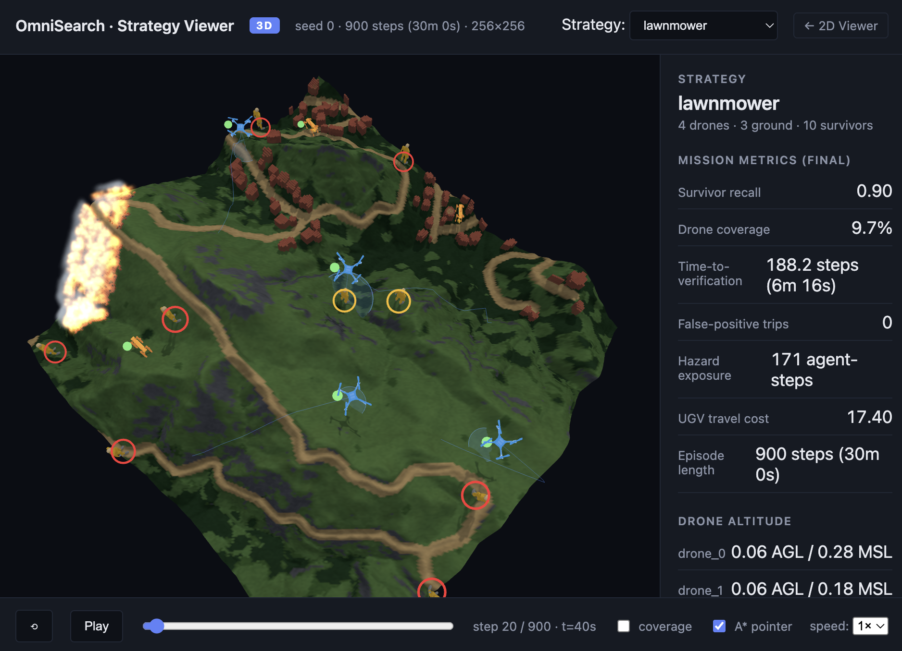

# OmniSearch

OmniSearch is a wildfire search-and-rescue simulation for heterogeneous teams
of UAVs and UGVs. UAVs scout survivors from above; UGVs navigate terrain to
confirm them on the ground. The project studies whether a learned HAPPO policy
can coordinate this handoff better than strong heuristic baselines.

MIDS Capstone · Summer 2026 · UC Berkeley



## What Is Included

- A VMAS-based wildfire search environment with UAVs, UGVs, survivors, fire,
  smoke, terrain, and communication dropout.
- A probabilistic UAV perception model for detection and confidence-map
  updates.
- HAPPO training and checkpoint loading.
- Hand-coded baselines such as lawnmower, ant-colony, random walk, and
  highest-confidence targeting.
- Diagnostic scripts for baseline comparison, ablations, communication dropout,
  terrain generalization, and survivor-load experiments.
- A browser-based 3D trajectory viewer.

## Setup

Requirements: Python 3.10 or 3.11 on macOS or Linux.

```bash
git clone <repo-url> omnisearch
cd omnisearch

python3.11 -m venv .venv
source .venv/bin/activate

pip install --upgrade pip
pip install -e ".[dev]"
```

Optional extras:

```bash
pip install -e ".[geo]"    # terrain-cache building and 3D terrain reports
pip install -e ".[cv]"     # OpenCV / detector utilities
pip install -e ".[happo]"  # HAPPO / HARL training support
pip install -e ".[docs]"   # documentation rendering utilities
```

Or install all optional extras:

```bash
pip install -e ".[all]"
```

## Quick Start

Export trajectories for the viewer:

```bash
python scripts/export_trajectories.py
```

Serve the viewer:

```bash
.venv/bin/python -m http.server 8080 --directory web
```

[Open the OmniSearch trajectory viewer](http://127.0.0.1:8080/index.html)

The link works while the local server above is running. To open it from another
terminal instead:

```bash
.venv/bin/python -m webbrowser -t http://127.0.0.1:8080/index.html
```

Train a HAPPO run:

```bash
pip install -e ".[happo]"
python scripts/train_happo_smoke.py
```

Run a baseline export with communication dropout:

```bash
python scripts/export_trajectories.py \
  --approach ant_colony \
  --comms-dropout 0.3 \
  --comms-dropout-mode bursty
```

## Real Terrain

The simulator can use cached real terrain layers. Build a cache once:

```bash
pip install -e ".[geo]"

python scripts/build_real_terrain_cache.py \
  --place "Malibu Creek State Park, California" \
  --grid-size 256
```

Then export trajectories on that terrain:

```bash
python scripts/export_trajectories.py \
  --terrain-cache-path data/terrain_cache/malibu_creek_1sqkm_256.npz \
  --grid-size 256 \
  --steps 900
```

## Main Scripts

| Script | Purpose |
|---|---|
| `scripts/train_happo_smoke.py` | Train HAPPO on the wildfire scenario |
| `scripts/export_trajectories.py` | Export viewer trajectories for HAPPO or baselines |
| `scripts/diagnose_joint_happo.py` | Evaluate trained HAPPO over many seeds |
| `scripts/diagnose_joint_baseline_strategies.py` | Evaluate one heuristic baseline over many seeds |

## Baselines

Baselines are implemented in `agents/baselines.py` and can be selected with
`--approach`:

```text
random_action
random_walk
lawnmower
highest_confidence
ant_colony
```

For baseline exports, UGV behavior can use either the baseline's native
targeting or the matched planner-aware controller:

```bash
python scripts/export_trajectories.py \
  --approach lawnmower
```

## Documentation

The detailed documentation lives in `docs/`:

- [Simulation overview](docs/simulation_overview.md)
- [Simulation pipeline](docs/simulation_pipeline.md)
- [Perception model](docs/perception_model.md)
- [Reinforcement learning and HAPPO](docs/reinforcement_learning_happo.md)
- [Observation and reward system](docs/observation_reward_system.md)
- [Baseline approaches and route planning](docs/baseline_approaches.md)
- [Communication dropout](docs/communication_dropout.md)
- [Web viewer notes](web/README.md)
- [Notebook guide](notebooks/README.md)

## Project Layout

```text
omnisearch/
├── envs/          # VMAS wildfire scenario
├── agents/        # HAPPO adapters, policies, and heuristic baselines
├── evaluation/    # metrics, rendering, trajectory export
├── scripts/       # training, diagnostics, export, terrain tools
├── docs/          # conceptual and operational documentation
├── notebooks/     # exploratory analysis
├── web/           # browser viewer
├── outputs/       # diagnostic outputs
└── results/       # training runs and local artifacts
```

## Outputs

Common generated artifacts:

| Path | Description |
|---|---|
| `data/terrain_cache/*.npz` | terrain caches |
| `web/trajectories/*.json` | viewer trajectories |
| `outputs/**/*.json` | diagnostic summaries |
| `outputs/**/*.png` | plots for reports and slides |
| `results/harl_runs/...` | HAPPO training runs |

## License

See [LICENSE](LICENSE).
